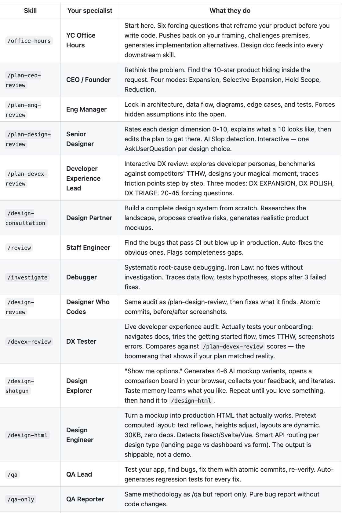
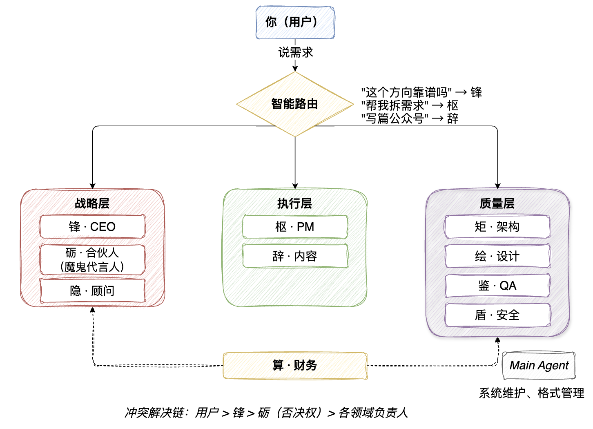

# 基于 Harness Engineering 思想，我再一次重构了我的 AI 团队

> 上一次是给 CodeBuddy 装规则以为是团队。这一次，我重新定义了一个团队。
 
---

## 前情提要

三个星期前，我写过一篇《[从 gstack 迁移 CodeBuddy：如何配置一支 Agent 团队](https://mp.weixin.qq.com/s/bKe5ke0__6Er6Bxx5k3LKw)》。

那篇文章讲的是什么？Y Combinator CEO Garry Tan 开源了 gstack，一套工程哲学——把 Claude Code 变成虚拟工程团队，CEO 审计划，架构师审设计，QA 打开真实浏览器测试。我花了三个星期，把这套东西从 Claude Code 移植到 CodeBuddy。17 个 Git 提交，+32K 代码净增，29 个规则文件，21+ 知识文档。



当时的感受是：**挺好用的。** `ship` 一键发布效率拉满，`careful + guard` 防止凌晨手误，`plan-design + plan-eng` 在流程前期拦截大部分问题。

但用了一段时间之后，问题慢慢浮出来。

---

## 散落的角色，不可控的体验

gstack-for-codebuddy（[github.com/voidlab7/gstack-for-codebuddy](https://github.com/voidlab7/gstack-for-codebuddy)）有 14 个角色，每个角色是一个独立的规则文件。

问题在哪？

**日常开发中，你经常忘记它们的存在。**

你得记住哪个规则叫什么名字，手动 @某个规则才会生效。今天忘了 @guard，就没有安全检查；明天忘了 @plan-eng，就跳过了工程审查。

这不是团队，这是一堆散落在角落的工具。想用的时候得自己想起来去拿，想不起来就形同虚设。

而且 14 个角色之间没有协作。CEO 审完了计划，PM 不知道；架构师说"方案有问题"，PM 说"必须按期交付"，没有人知道听谁的。

**我自己成了"人肉路由器"**——手动复制上下文，手动告诉下一个角色"上一个说了什么"。

从第一性原理出发：一个人能记住并有效调度 14 个角色吗？不能。10 个角色 × 15 条认知模式 = 150 条规则，没有人能记住。角色越多，认知负荷越高，越容易出错。

**AI 团队，应该是一个整体。** 不是散落的规则文件等你去 @，而是你说需求，它自己知道该谁来做。

所以我决定重构。不是在 gstack-for-codebuddy 上修修补补，而是从头造一个新东西。

---

## 维弈阁的诞生

这个新东西叫**维弈阁**（Weiyige Pavilion）。

名字是我家人起的。"维"是维度的维，多角色就是多维度；"弈"是博弈的弈，角色之间有合作也有质疑，魔鬼代言人专门唱反调；"阁"是场所，一个所有角色共处的空间。

起完名字之后我想了想，觉得挺准，真的佩服她的直觉！

最近 AI Agent 圈子里流行一个公式：**Agent = Model + Harness**。

Model 是大模型本身——它只是一个文本进、文本出的函数。Harness 是模型之外的一切：记忆系统、协作协议、路由规则、反馈闭环、上下文管理。

打个比方：模型是 CPU，Harness 是操作系统。CPU 再强，操作系统拉胯，整体体验就是灾难。

Can.ac 做过一个实验：同一个模型，只换了文件编辑接口的调用方式（也就是只改了 Harness），编码基准分数从 6.7% 跳到了 68.3%。十倍差距，模型一样，Harness 不一样。

**维弈阁就是一套 Harness。**

gstack 给了角色定义和工程哲学，但 Harness 层有明显的缺口。具体说：

- **没有跨角色的上下文传递**。gstack 的 skill 之间靠"读上一步的文件"来串联，是约定式的，不是系统级的。CEO 审完了计划，PM 不一定知道。如果某个 skill 没去读上一步的输出，信息就断了。
- **记忆是孤岛**。`/office-hours` 写 design doc 存在本地，`/retro` 写 JSON 快照存在另一个地方，`/qa` 写 baseline 又存一个地方。每个 skill 自己管自己的状态，没有统一的记忆层。新开一个会话，agent 得重新从代码里推断上下文。
- **没有智能路由**。14 个 skill，用哪个靠你自己记。忘了 `/guard` 就没有安全检查，忘了 `/plan-eng` 就跳过工程审查。
- **没有反馈闭环**。审查是单向的——出报告，结束。真实团队是迭代的：不通过 → 改 → 再审 → 通过。

gstack 作者自己也知道这些问题。他的 TODOS.md 里有一条 P2 待办：`Design docs → Supabase team store sync`——说明跨会话记忆同步还在计划中，没实现。

说这些不是要踩 gstack。gstack 在它的定位里做得很好——单人 solo founder 的工程流水线，够用、够快、够直接。

但别人的工具始终是别人的。

我的做法是：从最小集合出发，选合适自己的部分，慢慢验证，逐步搭建。gstack 的角色哲学、工程纪律、builder ethos——这些我全部吸收了。但协作协议、记忆系统、路由机制，这些得自己摸索、自己踩坑、自己沉淀。

别人告诉你的经验，你听过就忘了。自己踩出来的坑，才长在骨头里。

维弈阁做的事情，就是从 gstack 里拿走种子，在自己的土壤里种出来。

"维"——多维度的角色。"弈"——角色之间的博弈和协作。"阁"——承载这一切的 Harness。

### 第一刀：砍角色

gstack-for-codebuddy 有 14 个角色。我先问了自己：哪些角色是在"写代码"，哪些是在"做决策"？

gstack 最重要的洞察是什么？**代码是生成物，不是岗位。**

你不需要一个"前端工程师"的 Agent。你需要的是一个能做架构决策的 Agent，代码只是它的输出之一。前端关键词、后端关键词，都应该路由到架构师那里去。

所以：

- **前端** — 砍掉。组件化思维、技术选型，架构师接管。
- **后端** — 砍掉。数据流设计、接口规范，架构师接管。
- **法务** — 砍掉。个人项目现阶段不需要，合伙人的质疑能力覆盖了部分风控。

14 → 11。砍掉的不是能力，是多余的层级。

### 从规则文件到完整人设

gstack 的角色定义是一个规则文件。维弈阁的角色定义是三样东西：

- **IDENTITY** — 性格、说话风格、沟通方式
- **SOUL** — 思维框架、决策逻辑、方法论
- **memory** — 记住偏好、踩过的坑、积攒的知识

每个角色有自己的名字，不是"PM Agent"、"QA Agent"这种冷冰冰的标签。锋、枢、矩、绘、鉴、盾、算、辞、隐、砺——每个名字对应一种气质。

名字不只是装饰。叫"锋"的时候，你期待果断；叫"砺"的时候，你期待尖锐。名字塑造了交互预期。

### 11 个角色，各自带技能

| 角色 | 干什么 | 专属技能 |
|------|--------|---------|
| 锋 · CEO | 方向对不对？该不该做？ | 18 种认知模式（Bezos 单向门/双向门等） |
| 枢 · PM | 怎么拆？什么时候交？ | PRD 模板、设计评审规则 |
| 矩 · 架构 | 系统怎么设计？技术债多少？ | 工程审查规则、15 条架构思维 |
| 绘 · 设计 | 体验行不行？ | AI 烂俗 10 大反模式、设计评审规则 |
| 鉴 · QA | 哪里有 bug？ | QA 规则、WTF-likelihood 自控机制 |
| 盾 · 安全 | 有没有漏洞？ | OWASP/STRIDE 威胁模型 |
| 算 · 财务 | 划不划算？ | 相对定价模型（非硬编码） |
| 辞 · 内容 | 文案怎么写？AI 味去了吗？ | De-AI-ify、Humanizer、Copywriting |
| 隐 · 顾问 | 需要深度研究？ | 芒格式多元思维 |
| 砥 · 合伙人 | 专门唱反调 | YC 风格质疑 |

### 组织架构：三层 + 路由器



**不是 11 个独立个体。是 3 个层 + 1 个路由器。**

---

## 第一性原理：团队到底需要什么

维弈阁搭完之后，我没急着用。

我先给它做了一次体检。工具是老朋友——第一性原理 + 芒格的多元思维模型。

### 根本问题：一个人 + AI 团队，能不能 10x？

拆解一下前提：

- ✅ AI 能理解角色化的专业指令——没问题
- ✅ 专业化分工能提升效率——没问题
- ⚠️ Agent 之间能有效协作——**最薄弱的环节**
- ⚠️ 一个人能有效调度 11 个 Agent——**认知负荷问题**

两个黄灯。尤其是第二个——11 个角色 × 每个角色十几条认知模式 = 上百条规则。没有人能全记住。

> 从第一性原理推导：一个项目从想法到交付，本质上只需要三件事——**决策**（做不做）、**执行**（怎么做）、**质量**（做对了吗）。

三件事，对应三个层：

- **战略层**：锋 + 砺 + 隐（决策、质疑、研究）
- **执行层**：枢 + 辞（项目管理、内容输出）
- **质量层**：矩 + 绘 + 鉴 + 盾（架构、设计、测试、安全）

算游离在三层之外，专门算账。

这不是 11 个独立个体，是 **3 个层 + 1 个路由器**。路由器才是核心。没有路由器，11 个人就是 11 个孤岛。

---

## 芒格的五个模型，查出了什么病

### 能力圈："待在你懂的领域里"

我翻了一下 CEO 的配置文件。里面写满了设计原则——"层级即服务"、"减法默认"……

这些是设计师的活。

PM 的配置里有技术可行性评估，这是架构师的领域。

**每个角色都在越界。** 一个人什么都管，等于什么都不管。

### 逆向思考："如果这次失败了，最可能的原因？"

1. 角色还是太多——11 个对个人项目可能还是超了
2. 路由不够智能——用户还是得手动选人
3. 协议层只是文档，没有真正跑通
4. 记忆目录又空了——从来没跑过实战

第 4 条让我愣了一下。所有记忆目录，全是空的。说明这套系统搭完之后还没有真正跑过一个完整项目。

**沉没成本的味道。**

### 复利思维："什么东西会越用越值钱？"

记忆。每个 Agent 有三个记忆文件：偏好、教训、知识。每次用都在积累。用 10 次之后，它知道你喜欢什么风格、踩过什么坑、哪些方案靠谱。

但如果记忆目录永远是空的，复利就永远是零。

### 激励机制："给我看激励机制，我就能预测结果"

砺有一票否决权，锋有最终决策权。

但这只是文字约定，没有流程保障。就像公司章程写得再好，没有董事会流程，也是一纸空文。

---

## 查出的病，一天治完

### 1. 清理职责越界

CEO 配置里的设计原则，还给设计师。PM 配置里的技术评估，还给架构师。

**每个人守好自己的能力圈。**

### 2. 建立协作协议层

定义了 Agent 之间的"语言"：

- **交接块**：干完活必须附带标准化的交接信息——谁干的、干了什么、关键决策、下游建议
- **RACI 矩阵**：谁负责、谁审批、谁咨询、谁知会，一张表说清
- **冲突解决链**：用户 > CEO > 魔鬼代言人否决权 > 各领域负责人
- **反馈闭环**：审查不是走过场。不通过就改，改完再审，最多 3 轮。超了升级到用户决策

### 3. 实现记忆系统

三层架构：
- 短期：当前对话（自动）
- 中期：项目级（每个阶段结束沉淀）
- 长期：团队级（跨项目的教训和偏好）

这是复利的起点。

### 4. 智能路由

这是最重要的一刀。

用户不用记 11 个角色名字。路由器根据你说的话自动分发：

- "这个方向靠谱吗" → 锋
- "帮我拆需求" → 枢
- "写篇公众号" → 辞
- "有什么风险" → 砺

想精确调用也行，`@锋`、`@辞`，直接指名。

路由表直接内联在配置文件里。AI 打开项目的那一刻就拿到了路由表，零冷启动。不用再去读额外的文件。

之前在 gstack-for-codebuddy 里，角色生不生效取决于你记不记得去 @。现在不需要了。你说需求，路由器自己判断。

### 5. 三档模式

不是每件事都要走全流程。小事 Quick 模式，5 分钟搞定；日常 Standard 模式；重大决策 Deep 模式，拉满方法论。

---

## 验证：用实战说话

芒格说：**先在小范围内证明模式有效，再扩展。**

所以我做了一个实验：用维弈阁从零实现最近很火的一个 SBTI（Science Based Targets initiative）的本地简单网页。

同时，我用一个完全空白的项目——没有任何 Agent 配置，直接让 AI 从零写——做同样的东西。

对比什么：
- 代码质量
- 功能完成度
- 安全性
- 用户体验
- 花了多少轮对话

如果 Agent 流没有明显优势，那这套系统就是过度设计。

如果 Agent 流确实更好，那记忆目录里就有了第一批真实数据。这是复利的起点。

---

## 实战验证：SBTI 宠物人格网页

我做了个对比实验。

两个空白的 CodeBuddy 工程，同一个模型 GLM-5，同一句提示词：

> 做一个本地网页，设计一个宠物的 SBTI，结合 sbti.unun.dev 的产品思路。

唯一区别：**一个装了维弈阁，一个没装。**

结果差距很大。

### 装了维弈阁

CEO 先审批方向，PM 拆需求，设计师出 UI 方案，架构师写代码，QA 打开浏览器测。整个流程自动跑下来：

<table>
<tr>
<td width="50%">


*角色协作流程*

</td>
<td width="50%">


*16 种宠物人格选型*

</td>
</tr>
<tr>
<td width="50%">


*测试入口页*

</td>
<td width="50%">


*ESTJ 结果 + 人格解读*

</td>
</tr>
</table>

从需求到可运行页面，一次通过。

### 没装维弈阁

同一个提示词，没有任何 Agent 流程。AI 直接开始写代码——首页和选型页确实出来了，但点进结果页直接白屏：

<table>
<tr>
<td>


*选型没问题，结果页白屏*

</td>
</tr>
<tr>
<td>


*折腾几轮后重新生成，能跑了，但粗糙很多*

</td>
</tr>
</table>

不是模型不行。是没有人告诉它该做什么不该做、先做什么后做什么、做完怎么检查。

维弈阁做的就是这件事。

---

顺便踩了一个坑：**CodeBuddy 首次打开项目时会读取 CLAUDE.md，但不代表激活了里面的角色系统。** 我观察日志发现，它只是"读到了"，并没有真正按路由表分发、没有调用 Agent 的 SOUL。需要再问一句，为什么没有激活角色，整个系统才按照流程跑起来，后续基本都没问题了。第二次启动也没问题了。

这说明一件事：**配置文件只是说明书，不是自动运行的引擎。** 你得先点火，发动机才会转起来。如果不是确定性的代码，大模型，或者产品的编排，也会让整个工作流在某些情况变得不确定。面向AI编程，开发的是缰绳，是外壳，马是什么马有时候还真不一定，哈哈。


## 一键安装

上次的系统只有自己能用——得 clone 仓库，手动复制文件，改配置。

这次做了一键安装：

```bash
curl -fsSL https://raw.githubusercontent.com/voidlab7/weiyige-pavilion/main/install.sh | bash
```

支持 5 种工具：CodeBuddy、Claude Code、Cursor、GitHub Copilot、Windsurf、Cline。
但是实话说：GitHub Copilot、Windsurf、Cline 我没有验证过，需要的可以自己适配一下。
其他的我都验证过了。
已有配置文件？不会覆盖，自动备份，生成独立文件，提示你合并。

想试试的话：

```
@辞 帮我写一篇公众号文章
@锋 这个方向靠谱吗
帮我优化这篇文章    → 自动路由到 辞
```

---

## 走到现在的感受

从 gstack-for-codebuddy 到维弈阁，最大的认知变化是：

**散落的规则文件不是团队。**

gstack 教会了我工程哲学——先搜索再建造、反谄媚、一键发布。这些东西我全部保留了，融进了每个角色的 SOUL 里。

但规则文件的问题在于：它是被动的，等你去 @。团队应该是主动的，你说需求它就动。

维弈阁想解决的就是这个：**从"我记得用哪个工具"变成"它自己知道该谁来做"。**

理论再完美，不如一次实战。
---

## 如果你也在玩多 Agent

几条踩坑心得：

1. **别急着堆角色**，先想清楚最小团队是几个
2. **代码是生成物不是岗位**，不需要"前端Agent"和"后端Agent"
3. **路由器比角色重要**，没有路由器，多角色=多混乱
4. **给 Agent 记忆**，不然每次都是从零开始
5. **跑一个真实项目验证**，空谈是最大的敌人

gstack 给了种子。维弈阁是长出来的树。

还在长。

---

*维弈阁成长日记第二篇。一个人 + AI 团队的实验，继续。*

*上一篇：[从 gstack 迁移 CodeBuddy：如何配置一支 Agent 团队](https://mp.weixin.qq.com/s/bKe5ke0__6Er6Bxx5k3LKw)*
*项目地址：https://github.com/voidlab7/weiyige-pavilion*
*gstack-for-codebuddy：https://github.com/voidlab7/gstack-for-codebuddy*
